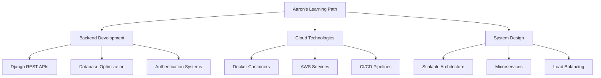

#  Hey there! I'm **Aaron Binu Mathews**

<div align="center">
  
[](https://git.io/typing-svg)

</div>

---

## 🎯 **About Me**

```python
class AaronBinuMathews:
    def __init__(self):
        self.name = "Aaron Binu Mathews"
        self.role = "Full Stack Django Developer"
        self.location = "Kerala, India"
        self.current_focus = ["Django REST Framework", "Cloud Deployment", "System Design"]
        self.languages = ["Python", "JavaScript", "SQL"]
        
    def current_projects(self):
        return [
            "🔧 Building scalable Django applications",
            "☁️ Learning Docker & Cloud deployment",
            "🤝 Contributing to Open Source projects"
        ]
    
    def fun_fact(self):
        return "I love automating boring stuff with Python! 🐍✨"
```


### 🔭 **Currently Working On**
- Building robust **Django & Python applications**
- Developing **RESTful APIs** with Django REST Framework
- Exploring **microservices architecture**

### 🌱 **Learning Journey**
- **Django REST Framework** - Advanced API development
- **Docker & Containerization** - DevOps practices
- **AWS/GCP** - Cloud deployment strategies
- **System Design** - Scalable architecture patterns

### 👯 **Open to Collaborate**
- Open Source **Django projects**
- **API development** initiatives
- **Python automation** tools
- **Web development** projects

---

## 🛠️ **Tech Arsenal**

<div align="center">

### **Languages & Core Technologies**


### **Frameworks & Libraries**


### **Databases & Storage**


### **DevOps & Tools**


### **Cloud & Deployment**


</div>

---

## 📊 **GitHub Analytics**

<div align="center">
  


</div>

<div align="center">
  


</div>

### **Contribution Graph**


---

## 🏆 **Achievements & Stats**

<div align="center">


</div>

---

## 🧩 **Competitive Programming**

<div align="center">

[](https://leetcode.com/Aaron_Binu/)

</div>

**Problem Solving Focus Areas:**
- 🔢 **Data Structures & Algorithms**
- 🧠 **Dynamic Programming**
- 🌳 **Trees & Graphs**
- 💡 **System Design Problems**

---

## 📈 **Current Focus Areas**



---

## 🌐 **Let's Connect & Collaborate**

<div align="center">

[](https://www.linkedin.com/in/aaron-binu-mathews-a43222344)
[](https://github.com/Aaron-BM)
[](mailto:your.email@gmail.com)
[](https://your-portfolio.com)

</div>

### 💬 **Open for Discussions About:**
- 🐍 **Python Development** & Best Practices
- 🚀 **Django & REST API** Architecture
- ☁️ **Cloud Deployment** Strategies
- 🤖 **Automation** & Scripting
- 💡 **System Design** & Scalability

---

## 📝 **Latest Blog Posts**
<!-- BLOG-POST-LIST:START -->
- [Building Scalable Django APIs: Best Practices](https://your-blog.com)
- [Docker for Django Developers: A Complete Guide](https://your-blog.com)
- [Optimizing Database Queries in Django](https://your-blog.com)
<!-- BLOG-POST-LIST:END -->

---

## 🎯 **2024 Goals**

- [ ] Contribute to **5+ major open source projects**
- [ ] Master **AWS cloud services** for Django deployment
- [ ] Build and deploy **3 production-ready applications**
- [ ] Write **technical blogs** sharing knowledge
- [ ] Achieve **1000+ LeetCode problems** solved
- [ ] Learn **system design patterns** in depth

---

<div align="center">

### ⭐ **"Code is like humor. When you have to explain it, it's bad."** ⭐


[](https://github.com/Aaron-BM)

**Thanks for visiting! Let's build something amazing together! 🚀**

</div>

---

<div align="center">
  
</div>
